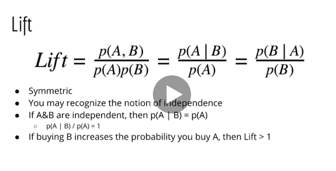
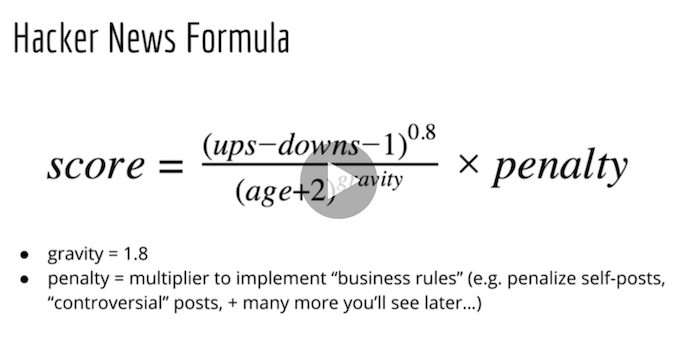
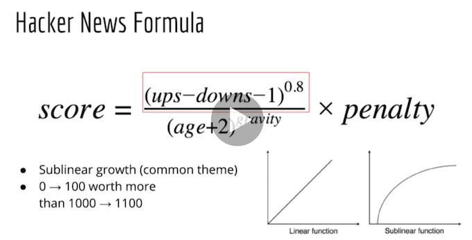
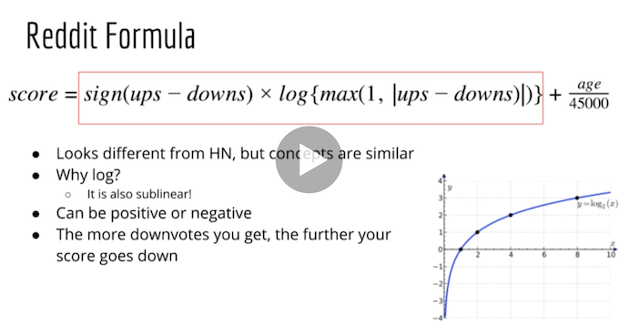
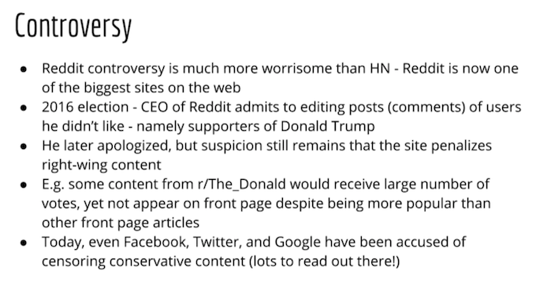
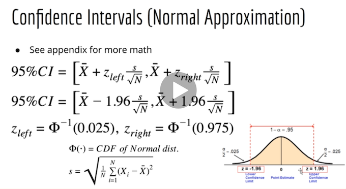
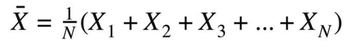
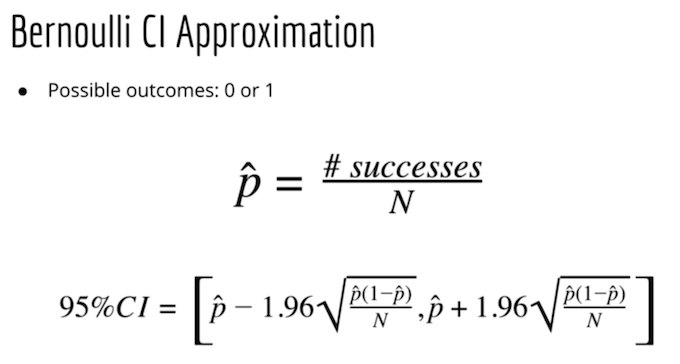
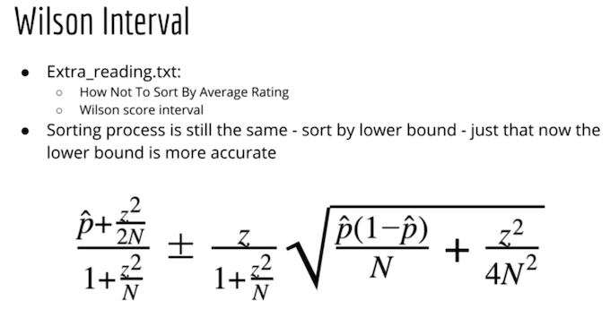

# Section2 - Simple Recommendation Systems

Content Table
- [Non-ML techniques](#Non-ML-techniques)
- [Hacker News Formula](#hacker-news-formula)
- [Raddit Formula](#Raddit-Formula)
- [Ratings](#Ratings)
- [Demographic and ML](#Demographic-and-ML)
- [Google PageRank](#Google-PageRank) 
- [Reading](#reading)

## Non-ML techniques
These are `non-ml techniques`, can be achived by SQL, while they are still powelful.

`Popularity` - lots of prople willing to pay money for these products.

- `Issue`: just popularity, doesn't mean you want it. Especially when you travel to a new city, you don't want McDoald's even it's the most popular restaurant. News, no one want to see an outdated popular news.

`Context` - product associations. If a person wants to buy an iPhone, he/she might also want to buy an iPhone case. 

- `count(A,B)/count(B)`, if it's close to 1.

- `P(A|B)` - Conditional probability statesthat given an event (event A), it will only occur if an event (event B) has already occurred. 

- `Issue` people who bought baby bedsheet also bought normal bedsheet; but does people buy bedsheet also buy baby bedsheet, no.

- lift

## Hacker News Formula

Since news is related very much to `age` (time), that's how Hacker News handle the recommendation

We can see as the age grows, score grows sublinear.

`Penalty` formula isn't known.
- if the link is too popular e.g. github.com
- too many comments - how controversial it is

"The unknown penalty is the powerful weapon of controlling media. isn't it?"

## Raddit Formula

`Controversy`

>I think the main takeaway is that we have all this cool math and there interesting algorithms. But at the end of the day it's politics and money that get the final decision on what you see. Perhaps the only true way to remain neutral is to be governed by robots.

## Ratings
News feed items typically hae upvotes and downvotes, likes...

Amazon, Walmart has 5 star ratings.

At high level, you can think of
- binary outcomes as classification
- 5 star ratings as regression

Problem of Avarage rating
- confidence: one 5 starts is better than 2 thousands rating as 4.8 star? No.

>the more samples I collect (N) the skinnier it's distribution 

>If X is not normally-distributed, according to Central Limit Theorem

### Bernoulli CI Approximation

Good for binary outcomes.

### Wilson Internal

Sorting process is still the same, sort by lower bound, just that now the `lower bound is more accurate`.

Can be extended to `5-star rating`. e.g.
- 1 star == 0 upvotes and 1 downvotes
- 2 star == 0.25 upvotes 0.75 downvotes
- 3 star == 0.5 upvotes and 0.5 downvotes
- 4 star == 0.75 upvotes 0.25 downvotes
- 5 star == 1 upvotes and 0 downvotes

Reddit uses Wilson Interval for comments.

`Why lower bound is good?`
Because it accounts for number of people who rated the item
- higher number of raters -> small CI -> higher lower bound
- in the sense the popularity increases the score

### Smoothing

`The problem and the solution`: If a product has no rating, we give a value by default. The default value should be between the middle value and the real ratings from other products. We call this `smoothing`.

`Explore-Exploit Dilemma`:
Example problem for Youtube, if you watch a bunch of videos on how to make eggs, then recommendations are filled with videos about making eggs. 

But if Youtube now serve by a stronger exploration component, e.g. movie trailers, you could think it's a bad site with nothing you are interested in. Then now Youtube is in `Explore-Exploit Dilemma`.

### Bayesian Approach
Bayesian approach builds on top of Likelihood.

Study up:

`Bernoulli Distribution`
`Bayes rule`

### Why do you need a library?

What I understand is, libraries are only for tools help you out, but don't use libraries for core approach.

## Demographic and ML
Demographoc data does not represent the product data. We can build the product data to the feature, and use only one model to predict many product results.

>Another course to refer: Logistic Regression and Deep Learning 1.

`input`: is_mobile, n_products_viewed, visit_duration, is_returning_visitor

`target`: bounce, add to card, begin check, complete checkout

>So people noticed that Demographic data was harder to collect.

Explicitly -> Implicitly

`Latent variable models` - features are learnd automatically.

`Matrix factorization`

## Google PageRank

`The PageRank of a page is the probability I would end up on that page if I surfed the Internet randomly for an infinite amount of time.`

`Markov Model` - probabilistic language model, does not depend on more steps behind `only the immediate last value`. e.g. p(love | I), p(the | the)

>Isn't it finite state machine? No, because Markov Chain describes the possibility `probabilistic rather than deterministic`. But A finite state machine can be used as a representation of a Markov chain. There is a thing called [Finite Markov Chain Processes](https://en.wikipedia.org/wiki/Finite-state_machine#Finite_Markov_chain_processes)

## Reading
- http://www.righto.com/2013/11/how-hacker-news-ranking-really-works.html
