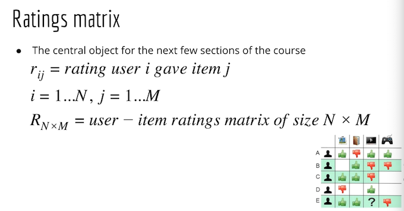

# Section 3 Collaborative Filter

Find a score for each item, and personalise it. 

s(j) -> s(i, j), so now it depends both on user i and item j. We can take is as `how much does user i like the item j?`

## Exercise

### What is the problem we want to solve?
`For User A, based on the movies he watched and rated, should we recommend a certain movie to him?`

### Step through

### Key APIs

dataframe.corrwith()

dataframe.merge(a, b)

### Data
[kaggle movielens 20 million](https://www.kaggle.com/grouplens/movielens-20m-dataset?select=rating.csv)

### Code

[Exercise 1 notebook](./exercise-collaborative-filter/rating.ipynb)